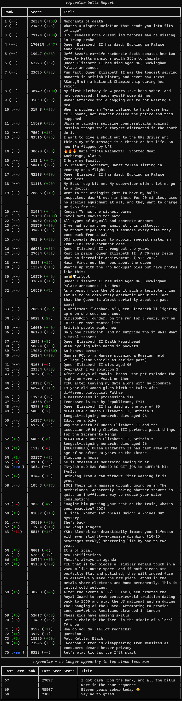

# redditdelta - see subreddit changes on the command line

## Prerequisites

- python3.8+
- [poetry](https://python-poetry.org/) (recommended, not required)

## Setup

For development I would recommend using poetry.

```
poetry install
```

By default, this will create a virtual environment for the project and install the project
there.  Because of this you will need to use `poetry run redditdelta` instead of just `redditdelta`.

Alternatively, you can bypass poetry completely and use pip to install it into any python environment: 

```
pip install .
```

## Running the tests

```
poetry run pytest ./tests
```

## Usage

```
 Usage: redditdelta [OPTIONS]

 Pulls the top posts from a subreddit and displays changes since last run.

╭─ Options ───────────────────────────────────────────────────────────────────────╮
│ --subreddit                 TEXT     Name of the subreddit to pull posts from.  │
│                                      [default: popular]                         │
│ --base-url                  TEXT     Base url of the reddit instance.           │
│                                      [default: https://www.reddit.com]          │
│ --state-dir                 TEXT     Local directory to save state in between   │
│                                      runs.                                      │
│                                      [default: .]                               │
│ --num-posts                 INTEGER  Number of posts to pull. [default: 75]     │
│ --install-completion                 Install completion for the current shell.  │
│ --show-completion                    Show completion for the current shell, to  │
│                                      copy it or customize the installation.     │
│ --help                               Show this message and exit.                │
╰─────────────────────────────────────────────────────────────────────────────────╯
```

## Example output

